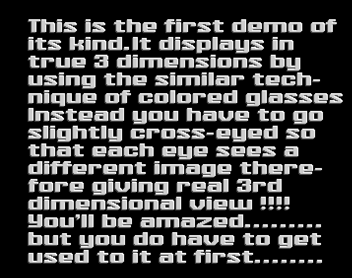
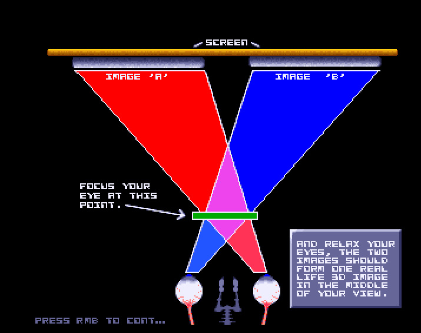
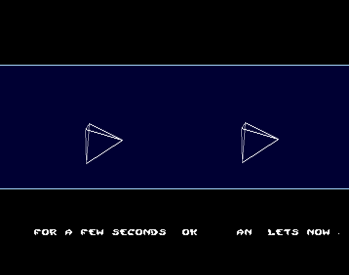
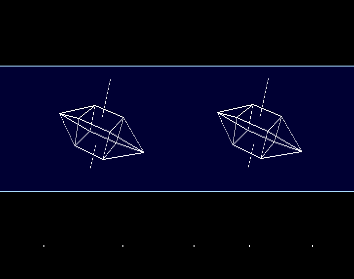
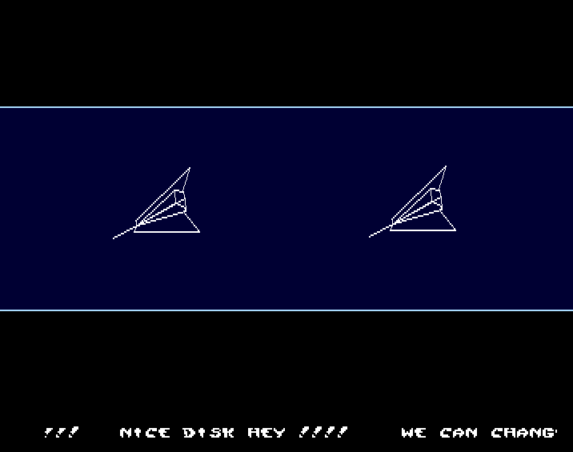

## Real3D Demo in 1990

Before 3D TVs and Projectors, you had to cross your eyes, but this uses the Side-by-Side 3d method.
So you can activate 3D on the tv, or projector and see it as it should be.

Some code path/file includes might need changing to 'assemble' into an executable.

## Images.

## LICENSE

Copyright (c) 2014, Raul Sobon <raul.sobon@gmail.com>

Permission to use, copy, modify, and/or distribute this software for any
purpose with or without fee is hereby granted, provided that the above
copyright notice and this permission notice appear in all copies.

THE SOFTWARE IS PROVIDED "AS IS" AND THE AUTHOR DISCLAIMS ALL WARRANTIES
WITH REGARD TO THIS SOFTWARE INCLUDING ALL IMPLIED WARRANTIES OF
MERCHANTABILITY AND FITNESS. IN NO EVENT SHALL THE AUTHOR BE LIABLE FOR
ANY SPECIAL, DIRECT, INDIRECT, OR CONSEQUENTIAL DAMAGES OR ANY DAMAGES
WHATSOEVER RESULTING FROM LOSS OF USE, DATA OR PROFITS, WHETHER IN AN
ACTION OF CONTRACT, NEGLIGENCE OR OTHER TORTIOUS ACTION, ARISING OUT OF
OR IN CONNECTION WITH THE USE OR PERFORMANCE OF THIS SOFTWARE.

